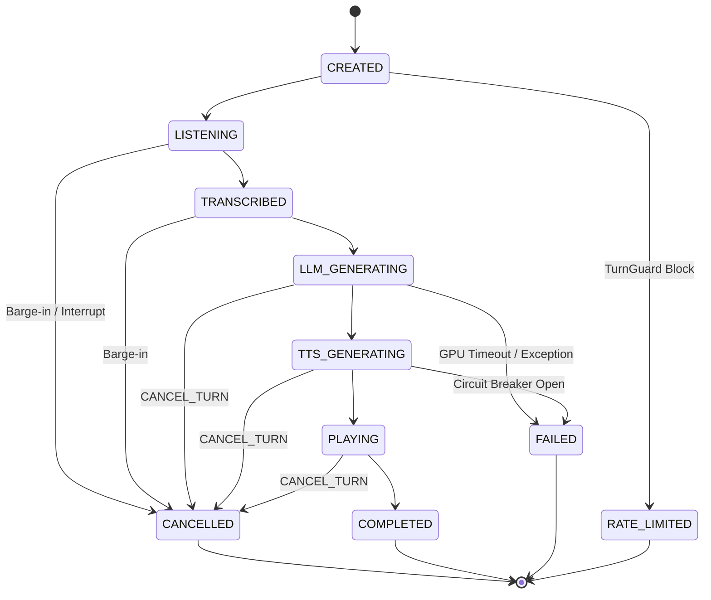

# MyAICoach: Real-Time AI Voice & Curriculum Architecture Blueprint

> **Ana İlke**: *"Vani öğretilecek bilgiyi icat etmeyecek; öğretim biçimini kişiselleştirecek."*

Bu doküman, **MyAICoach** platformunun gerçek zamanlı yapay zeka ses motoru (Real-Time Voice AI Engine), müfredat bütünlüğü (Curriculum Integrity), güvenlik zırhları (Security & Cost Guards) ve sistem topolojisinin nihai mühendislik mimarisidir.

---

## 📐 1. End-to-End Sistem Topolojisi

Sistem, **Modüler Monolit (Backend Orchestrator)** yaklaşımıyla tasarlanmıştır. Yalnızca yüksek GPU/Inference yükü getiren yapay zeka modelleri (STT, LLM, TTS) ayrık mikroservisler olarak çalışır.

```mermaid
flowchart TD
    subgraph Android App
        UI[Lesson Experience UI]
        STT_Client[Android STT / VAD]
        AudioTrack[AudioTrack PCM Player]
        AudioInterrupt[AudioInterruptionManager]
    end

    subgraph API Gateway / Edge
        Gateway[API Gateway / Auth]
        TurnGuard[TurnGuard: Anti-Thrashing]
        CostGuard[CostGuard: Quota & Token Metering]
    end

    subgraph Backend Orchestrator
        TurnSM[Conversation StateMachine]
        ContextSel[ContextSelector]
        PolicyEngine[TutorPolicy + SafetyPolicy]
        Validator[LessonValidator]
        Evaluator[TargetEvaluator: Deterministic Authority]
        Mastery[Student Mastery Engine]
        CircuitBreaker[Circuit Breaker & Capacity Queue]
    end

    subgraph AI Inference Workers (GPU)
        STT_Server[Whisper / Faster-STT Service]
        LLM_Server[vLLM: Qwen3 Non-Thinking]
        TTS_Server[VoxCPM2 Streaming TTS]
    end

    UI -->|Start Turn / Audio Stream| Gateway
    Gateway --> TurnGuard
    TurnGuard --> CostGuard
    CostGuard --> TurnSM

    TurnSM -->|Transcribe| STT_Server
    TurnSM --> ContextSel
    ContextSel --> PolicyEngine
    PolicyEngine --> CircuitBreaker

    CircuitBreaker -->|Structured Output| LLM_Server

    LLM_Server -->|Speech Stream| SpeechSegmenter[SpeechSegmenter: Clause + Timeout]
    LLM_Server -->|Metadata Stream| Evaluator

    SpeechSegmenter --> TTS_Server
    TTS_Server -->|PCM Chunks| AudioTrack

    Evaluator --> Mastery

    AudioInterrupt -->|CANCEL_TURN Signal| Gateway
    Gateway -->|Cancel Orchestration| TurnSM
    TurnSM -.->|Kill Generation| LLM_Server
    TurnSM -.->|Kill Inference| TTS_Server
```

---

## 🔄 2. Turn State Machine (Açık Yaşam Döngüsü)

Yarış koşullarını (Race Conditions), iki sesin üst üste binmesini (Audio Ghosting) ve stale paket kirliliğini önlemek için her diyalog turu (`turnId`) kesin bir durum makinesi takip eder.



> ⚠️ **Kritik Kural**: `CANCELLED` durumuna geçmiş bir `turnId` **asla** tekrar `PLAYING` veya `COMPLETED` durumuna geçemez. İptal edilmiş bir turn'e ait sonradan gelen tüm paketler hem sunucuda hem istemcide otomatik imha edilir (`discard`).

---

## 🛑 3. End-to-End Cancellation Propagation (Barge-in Protokolü)

Kullanıcı Vani konuşurken araya girdiğinde (Barge-in):

1. **Android Client**:
   - `AudioInterruptionManager` 150-200ms insan sesi doğrulaması ile tetiklenir.
   - `AudioTrack` çalımını anında durdurur ve lokal ses kuyruğunu temizler (`flush`).
   - Sunucuya `CANCEL_TURN(turnId)` sinyali gönderir.
2. **Backend Orchestrator**:
   - İlgili `turnId` durumunu derhal `CANCELLED` olarak işaretler.
   - Aktif LLM token üretimi iptal edilir (`AbortController` / `vLLM cancel`).
   - Bekleyen `SpeechSegmenter` tamponu sıfırlanır.
   - VoxCPM2 GPU sentezleme işi sonlandırılır.
   - Değerlendirme (`TargetEvaluator`) işlemi iptal edilir veya yoksayılır.

---

## 🛡️ 4. Güvenlik, Maliyet ve Kapasite Zırhları

### A. TurnGuard (Davranışsal Güvenlik)
* **Max Concurrency**: Kullanıcı başına aynı anda `maxActiveTurns = 1`.
* **Debounce Interval**: İptal sonrası yeni turn başlatmak için min `300ms` bekleme.
* **Sliding Window Rate Limit**: Max 4 turn / 10 saniye; Max 5 cancel / 30 saniye. İhlalde `429 TOO_MANY_REQUESTS` + Progressive Backoff Cooldown.

### B. CostGuard (Ekonomik Maliyet Güvenliği)
* Kota takibi sadece tamamlanan konuşmalardan değil, tüketilen hesaplama süresinden yapılır:
  - `dailyLlmTokens`
  - `dailyTtsSeconds`
  - `dailySttSeconds`
  - `cancelledComputeMs` (İptal edilen işlerin harcadığı GPU süresi)

### C. Circuit Breaker & Queue Management
* GPU servisleri aşırı yüklendiğinde veya TTS servisi çöktüğünde backend sınırsız istek yığmaz.
* Belirli bir hata/gecikme eşiği aşıldığında **Circuit Breaker** açılır ve kullanıcıya zarif bir `503 Service Unavailable` / Fallback bildirimi verilir.

### D. Idempotency & Turn Isolation
* Her istek `conversationId`, `turnId` ve `requestId` taşır.
* Aynı `requestId` ikinci kez ulaştığında yeni GPU işi başlatılmaz.

---

## 🎯 5. Pedagoji ve Veri Bütünlüğü Katmanları

### A. LessonValidator (Müfredat Doğrulama)
Ders kullanıcıya açılmadan önce veri bütünlüğünü kontrol eder:
- Tüm `WordIntroduction.wordId` değerleri `lesson.vocabulary` listesinde mevcut mu?
- Tüm `targetIds` geçerli hedeflere bağlı mı?
- `SentenceBuilderActivity` kelime çipleri doğru cümleyi oluşturabiliyor mu?
- Seçenekli sorularda doğru cevap `options` listesinde yer alıyor mu?

### B. ContextSelector (Akıllı Context Süzgeci)
LLM'e binlerce kelimelik veri göndermek yerine yalnızca aktif ders çevresi iletilir:
- `CurrentTargets` (Anlık hedefler)
- `WeakTargets` (Zayıf kalınan noktalar)
- `RecentKnownTargets` (Son derslerde kullanılan ~10-15 kelime)
- `ScenarioRelevantVocabulary` (Senaryo ile kesişen kelimeler)

### C. TargetEvaluator (Deterministik Backend Otoritesi)
- LLM'in sunduğu `targetObservations` bir **Öneri (Suggestion)**dir.
- Otorite backend'deki `TargetEvaluator` servisindedir:
  `Exact/Pattern Matcher` ──► `Rule-Based Grammar Check` ──► `Semantic Evaluator` ──► `Confidence Threshold Check`
- Güven skoru düşük olan durumlarda **Mastery güncellemesi yapılmaz.**

### D. Özgün İçerik ve Telif Stratejisi
- **Oxford 3000 / 5000 & CEFR**: Seviye belirleme (A1-B2) ve gramer sıralaması için **metodolojik referans** olarak kullanılır.
- Cümleler, egzersizler ve diyaloglar %100 **özgün varlıklarımızdır**.

---

## 📊 6. Observability (Gözlemlenebilirlik ve Gecikme Metrikleri)

Her diyalog turu için detaylı telemetri toplanır:

| Metrik | Açıklama |
| :--- | :--- |
| `time_to_first_transcript` | STT'nin ilk yazılı çıktıyı üretme süresi |
| `time_to_first_llm_token` | LLM'in ilk token'ı türetme süresi (TTFT) |
| `time_to_first_speech_segment` | SpeechSegmenter'ın ilk anlamlı cümleyi çıkarma süresi |
| `time_to_first_tts_pcm` | VoxCPM2'nin ilk ses paketini üretme süresi (TTFA) |
| `time_to_first_audio_playback` | Android'de sesin duyulmaya başladığı an |
| `cancelledComputeMs` | İptal edilen turların harcadığı toplam GPU ms süresi |

---

## 🚀 7. Aşamalı Uygulama Yol Haritası (Phased Implementation)

Modüler yapımızı aşama aşama koda dönüştüreceğiz:

```text
[AŞAMA 1]: Minimal Canlı Zincir (STT → LLM Stream → SpeechSegmenter → VoxCPM2 → PCM → Android)
[AŞAMA 2]: Pedagoji & Validation (LessonValidator + ContextSelector + structured_outputs)
[AŞAMA 3]: Real-Time Security & Mastery (TurnGuard + AudioInterruptionManager + TargetEvaluator + CostGuard)
```
