# MyAICoach: Sistem Mimarisi, Tamamlanan Geliştirmeler ve Topoloji Raporu (Güncel)

> **Proje Vizyonu**: "Vani öğretilecek bilgiyi icat etmeyecek; öğretim biçimini kişiselleştirecek."  
> CEFR ve Oxford 3000/5000 standartlarında, oyunlaştırılmış ve gerçek zamanlı AI konuşma koçluğu sunan modern Android uygulaması ve FastAPI Dual-Stream WebSocket Gateway altyapısı.

---

## 📐 1. Güncel Sistem Topolojisi (Updated System Topology)

```mermaid
graph TD
    subgraph UI_Layer ["🎨 UI Katmanı (Jetpack Compose - 100% TAMAMLANDI)"]
        HomeScreen["HomeScreen.kt\n(Vani Hero, %80 Günlük Hedef, Yol Haritası)"]
        CategoryScreen["LessonCategoryScreen.kt\n(Öne Çıkan Ünite & 2 Sütunlu CEFR)"]
        WordIntroCard["WordIntroductionCard.kt\n(Dev Kelime & Ses Dalgası)"]
        MatchingCard["MatchingCard.kt\n(2 Sütunlu Soketler & Bezier İp Çizgileri)"]
        QuizCards["MultipleChoiceCard / FillInTheBlank / SentenceBuilder"]
        CompletionCard["LessonCompletionCard.kt\n(Kupa Rozeti, +50 XP & Vani CTA)"]
        ProfileScreen["ProfileScreen.kt\n(Avatar, 2x2 Rozetler & Haftalık Grafik)"]
        SpeakingScreen["SpeakingScreen.kt\n(Vani Reaktif Avatar & Live Mic Barge-In)"]
    end

    subgraph State_Layer ["🧠 ViewModel & State Katmanı (100% TAMAMLANDI)"]
        LessonVM["LessonViewModel.kt\n(Pedagojik Kelime-Test-Eşleştirme Akışı)"]
        SpeakingVM["SpeakingViewModel.kt\n(End-to-End Voice Loop & Coroutine Job Management)"]
        MascotState["MascotState.kt\n(6 Reaktif Kedi Tepki Durumu)"]
    end

    subgraph Turn_Security_Engine ["🛡️ Turn Engine & Güvenlik Katmanı (100% TAMAMLANDI)"]
        TurnController["TurnController.kt\n(Terminal Durum Değişmezliği Kuralı)"]
        TurnGuard["TurnGuard.kt\n(300ms Debounce & Per-User Concurrency=1)"]
        ConversationTurn["ConversationTurn.kt\n(UUID Tabanlı Tur Modeli)"]
        VoiceProtocol["VoiceProtocol.kt & VoiceStreamMessage.kt\n(10 Wire Protokol Kontratı & protocolVersion=1)"]
    end

    subgraph Audio_Streaming_Engine ["🎙️ Canlı Ses & Streaming Motoru (100% TAMAMLANDI)"]
        AudioTrackEngine["AudioPlaybackController.kt\n(Native AudioTrack PCM 48kHz Mono Streaming)"]
        BargeInEngine["User Barge-In\n(AudioTrack.flush() & Instant Cancel)"]
        SpeechSegmenter["SpeechSegmenter.kt\n(Low First-Audio Latency Cümle Bölümleyici)"]
        SttManager["SttManager.kt\n(Android SpeechRecognizer & Transcripts)"]
    end

    subgraph Backend_Gateway ["🌐 FAZ 3: FastAPI Backend & Dual-Stream Gateway (100% TAMAMLANDI)"]
        FastApiGateway["app/main.py\n(FastAPI WebSocket Gateway /v1/voice/stream)"]
        ServerTurnGuard["guards/turn_guard.py\n(Server-Side Rate Limit 300ms & Concurrency=1)"]
        TurnOrchestrator["orchestration/turn_orchestrator.py\n(Sequence Authority & Task Cancellation)"]
        ServerSegmenter["services/speech_segmenter.py\n(Server-Side Token Buffer & Sentence Splitter)"]
        QwenService["services/qwen_llm_service.py\n(Qwen3 Token-by-Token Streaming API)"]
        VoxCpmService["services/voxcpm_tts_service.py\n(VoxCPM2 48kHz PCM Streaming API)"]
    end

    subgraph Future_Roadmap ["🚀 Gelecek Yol Haritası (Next Steps)"]
        RoomDB["Room Offline DB & Local Progress Cache"]
        HigherCEFR["CEFR A2 / B1 / B2 Müfredat Paketi"]
        DockerGPU["Docker GPU / vLLM & PyTorch Heavy Deployment"]
    end

    UI_Layer --> State_Layer
    State_Layer --> Turn_Security_Engine
    Turn_Security_Engine --> Audio_Streaming_Engine
    Audio_Streaming_Engine <--> Backend_Gateway
    Backend_Gateway -.-> Future_Roadmap
```



---

## 🏆 2. Neler Yaptık ve Nasıl İlerledik? (Tamamlanan Aşamalar)

### 🎨 FAZ 1: 7 Ekranlık UI Tasarım Sistemi ve CEFR A1 Müfredatı (%100 Tamamlandı)
- **Ekran Tasarımları**: `HomeScreen`, `LessonCategoryScreen`, `WordIntroductionCard`, `MatchingCard` (Bezier ip çizgileri), `SentenceBuilderCard`, `LessonCompletionCard`, `ProfileScreen` tamamlandı.
- **CEFR A1 Müfredat Deposu**: 12 Core Ders + 3 Vani Canlı Konuşma Senaryosu (`A1Lesson1` .. `A1Lesson12` & `A1Scenario1` .. `A1Scenario3`).
- **LessonValidator**: Veri tutarlılığı ve sıfır çökme doğrulama motoru eklendi.

### 🎙️ FAZ 2: Android Canlı Ses ve Tur Güvenlik Katmanı (%100 Tamamlandı)
- **Turn State Machine & TurnGuard**: 10 Tur Durumu, terminal durum değişmezliği ve 300ms Debounce / Per-User Concurrency = 1 eklendi.
- **AudioPlaybackController (48 kHz PCM)**: Native Android `AudioTrack` 48,000 Hz 16-bit Mono Streaming ve `stopAndFlush()` ile anlık User Barge-In entegre edildi.
- **Wire Protocol & Sürüm Kontrolü**: `VoiceProtocol.kt` (`VERSION = 1`) ve `VoiceStreamMessage.kt` kontratları sertleştirildi.

### 🌐 FAZ 3: FastAPI WebSocket Backend & Streaming Boru Hattı (%100 Tamamlandı)
- **FastAPI WebSocket Gateway**: `/v1/voice/stream` dual-stream endpoint'i.
- **Server-Side TurnGuard & Sequence Authority**: Sunucu tarafı rate limit (300ms) ve monoton `sequenceId` yönetimi.
- **Qwen3 LLM Token Streaming (`QwenLlmService`)**: Kelime kelime canlı jeton akışı.
- **Server-Side SpeechSegmenter (`ServerSpeechSegmenter`)**: Gecikmeyi sıfırlamak için LLM cevabının bitmesini beklemeden ilk noktada cümleyi kesip TTS'e gönderen cümle bölümleme motoru.
- **VoxCPM2 48kHz PCM Streaming (`VoxCpmTtsService`)**: Cümle parçalarını anında 48kHz PCM ses paketlerine dönüştürüp akıtan servis.
- **Docker Konteyner Yapısı**: `python:3.11-slim` Dockerfile ve `docker-compose.yml` canlı olarak test edildi ve doğrulandı!

---

## 🚀 3. Neler Yapmalıyız? (Gelecek Yol Haritası)

```
[ Gelecek Yol Haritası ]
  ├── 1. Docker GPU / vLLM ve PyTorch Ağır Model Sunucu Bağlantısı (Heavy Model Serving)
  ├── 2. Offline Mod & Room Database Persistence (Çevrimdışı Ders Önbellekleme)
  └── 3. CEFR A2 / B1 / B2 İleri Seviye Müfredat Genişletmesi
```

1. **Docker Heavy Model Serving (GPU / vLLM)**:
   - Yerel/bulut GPU ortamında vLLM (Qwen3) ve PyTorch (VoxCPM2 V2) servislerinin `docker-compose.yml` içerisine eklenmesi.
2. **Offline Mod ve Room Database**:
   - İnternet olmadığında müfredat derslerinin ve kullanıcı XP ilerlemelerinin yerel `Room DB` üzerinde önbelleklenmesi.
3. **CEFR A2 / B1 / B2 Seviye Genişletmesi**:
   - A2 (Geçmiş Zaman, Seyahat, İş), B1 (Tartışma & İş Dünyası) müfredat içeriklerinin eklenmesi.
