# MyAICoach: Sistem Mimarisi, Tamamlanan Geliştirmeler ve Topoloji Raporu (Güncel)

> **Proje Vizyonu**: "Vani öğretilecek bilgiyi icat etmeyecek; öğretim biçimini kişiselleştirecek."  
> CEFR ve Oxford 3000/5000 standartlarında, oyunlaştırılmış ve gerçek zamanlı AI konuşma koçluğu sunan modern Android uygulaması.

---

## 📐 1. Güncel Sistem Topolojisi (Updated System Topology)

```mermaid
graph TD
    subgraph UI_Layer ["🎨 UI Katmanı (Jetpack Compose - 100% TAMAMLANDI)"]
        HomeScreen["HomeScreen.kt\n(Vani Hero, %80 Günlük Hedef, Yol Haritası)"]
        CategoryScreen["LessonCategoryScreen.kt\n(Öne Çıkan Ünite & 2 Sütunlu CEFR)"]
        WordIntroCard["WordIntroductionCard.kt\n(Dev Kelime & Ses Dalgası)"]
        MatchingCard["MatchingCard.kt\n(2 Sütunlu Soketler & Bezier İp Çizgileri)"]
        QuizCards["MultipleChoiceCard / FillInTheBlank / SentenceBuilder"]
        CompletionCard["LessonCompletionCard.kt\n(Kupa Rozeti, +50 XP & Vani CTA)"]
        ProfileScreen["ProfileScreen.kt\n(Avatar, 2x2 Rozetler & Haftalık Grafik)"]
        SpeakingScreen["SpeakingScreen.kt\n(Vani Reaktif Avatar & Live Mic Barge-In)"]
    end

    subgraph State_Layer ["🧠 ViewModel & State Katmanı (100% TAMAMLANDI)"]
        LessonVM["LessonViewModel.kt\n(Pedagojik Kelime-Test-Eşleştirme Akışı)"]
        SpeakingVM["SpeakingViewModel.kt\n(End-to-End Voice Loop & Coroutine Job Management)"]
        MascotState["MascotState.kt\n(6 Reaktif Kedi Tepki Durumu)"]
    end

    subgraph Turn_Security_Engine ["🛡️ Turn Engine & Güvenlik Katmanı (100% TAMAMLANDI)"]
        TurnController["TurnController.kt\n(Terminal Durum Değişmezliği Kuralı)"]
        TurnGuard["TurnGuard.kt\n(300ms Debounce & Per-User Concurrency=1)"]
        ConversationTurn["ConversationTurn.kt\n(UUID Tabanlı Tur Modeli)"]
        VoiceEvent["VoiceEvent.kt\n(10 Ağ Protokol Kontratı)"]
    end

    subgraph Audio_Streaming_Engine ["🎙️ Canlı Ses & Streaming Motoru (100% TAMAMLANDI)"]
        AudioTrackEngine["AudioPlaybackController.kt\n(Native AudioTrack PCM 24kHz Mono Streaming)"]
        BargeInEngine["User Barge-In\n(AudioTrack.flush() & Instant Cancel)"]
        SpeechSegmenter["SpeechSegmenter.kt\n(Low First-Audio Latency Cümle Bölümleyici)"]
        SttManager["SttManager.kt\n(Android SpeechRecognizer & Transcripts)"]
        VoxCpmClient["VoxCpmStreamClient.kt\n(VoxCPM2 Dual-Stream Client)"]
        LlmClient["LlmStreamClient.kt\n(Qwen/Gemini Token Streaming)"]
    end

    subgraph Domain_Data_Layer ["📜 Domain & Repository Katmanı (100% TAMAMLANDI)"]
        LessonValidator["LessonValidator.kt\n(Sıfır Çökme / Veri Doğrulayıcı)"]
        FullCurriculum["CEFR A1 12 Ders Paketi & 3 Vani Senaryosu"]
        StudentState["StudentStateRepositoryImpl.kt\n(+50 XP, Seri & A2 Barajı)"]
        LessonRepo["LessonRepositoryImpl.kt\n(Full Catalog & Flow)"]
    end

    subgraph FAZ_3_Future ["🌐 FAZ 3: Gelecek Sunucu & Model Servis Katmanı"]
        BackendWebSocket["Backend WebSocket / gRPC Gateway"]
        ModelServing["Docker / Qwen LLM & VoxCPM2 TTS Server"]
        RoomCache["Room Offline DB & Local Cache"]
        A2Curriculum["CEFR A2 / B1 / B2 Müfredat Genişletmesi"]
    end

    UI_Layer --> State_Layer
    State_Layer --> Turn_Security_Engine
    Turn_Security_Engine --> Audio_Streaming_Engine
    State_Layer --> Domain_Data_Layer
    Audio_Streaming_Engine -.-> FAZ_3_Future
```



---

## 🏆 2. Neler Yaptık? (Tamamlanan FAZ 1 ve FAZ 2 Aşamaları)

### 🎨 FAZ 1A: 7 Ekranlık Bütünsel UI Tasarım Sistemi (100% Tamamlandı)
- **HomeScreen.kt**: Mor-turkuaz aura animasyonlu **Vani AI Kedi Hero Kartı**, dairesel %80 günlük hedef çemberi, 🔥 7 Günlük Seri ve dikey yol haritası.
- **LessonCategoryScreen.kt**: Öne Çıkan Ünite Banner'ı (%33 İlerleme) ve 2 sütunlu asimetrik CEFR kategori kartları (Gramer, Günlük Yaşam, Seyahat, İş).
- **WordIntroductionCard.kt**: Dev kelime başlığı, dairesel ses dalgası animasyonlu oynatma butonu (`scale(0.94f)`).
- **MatchingCard.kt**: Soketli 2 sütunlu düğümler, **Canvas Bezier ip çizgileri**, dokun-iptal et ve çakışmayan dinamik renk algoritması.
- **SentenceBuilderCard.kt & Quiz Kartları**: Yay fiziğiyle mikro basılma animasyonları (`scale(0.95f)`), dinamik renkli tepsi ve şıklar.
- **LessonCompletionCard.kt**: Altın kupa rozeti, `+50 XP` animasyonlu sayacı, konfeti patlaması ve doğrudan **"🎙️ Vani ile Konuşmaya Başla"** CTA butonu.
- **ProfileScreen.kt**: Kullanıcı avatarı, CEFR A1 seviye rozeti, 3 sütunlu istatistikler, 2x2 ışıldayan başarım rozetleri ve haftalık aktiflik grafiği.

---

### 📚 FAZ 1B: Tam CEFR A1 Müfredat Deposu (12 Core Ders + 3 Konuşma Senaryosu)
- **Ünite 1 (Greetings & Daily Life)**: `A1Lesson1` - `A1Lesson4` + `A1Scenario1` (Kafede Vani ile Tanışma).
- **Ünite 2 (Food, Drinks & Shopping)**: `A1Lesson5` - `A1Lesson8` + `A1Scenario2` (Süpermarket & Kafe Turu).
- **Ünite 3 (City, Places & Travel)**: `A1Lesson9` - `A1Lesson12` + `A1Scenario3` (🎓 A1 → A2 Mezuniyet Konuşması).

---

### 🎙️ FAZ 2: Canlı Ses ve AI Konuşma Motoru (100% Tamamlandı)
1. **Turn State Machine ([TurnState.kt](file:///c:/Users/ferhat/AndroidStudioProjects/MyAICoach/app/src/main/java/com/ferhat/myaicoach/feature/speaking/turn/TurnState.kt))**: 10 Tur Durumu ve terminal durum değişmezliği kuralı.
2. **Voice Event Protocol ([VoiceEvent.kt](file:///c:/Users/ferhat/AndroidStudioProjects/MyAICoach/app/src/main/java/com/ferhat/myaicoach/feature/speaking/turn/VoiceEvent.kt))**: `TURN_STARTED`, `AUDIO_CHUNK`, `TURN_CANCELLED` ağ kontratları.
3. **TurnGuard Security ([TurnGuard.kt](file:///c:/Users/ferhat/AndroidStudioProjects/MyAICoach/app/src/main/java/com/ferhat/myaicoach/feature/speaking/turn/TurnGuard.kt))**: 300ms debounce koruması ve Per-User Concurrency = 1.
4. **Low-Latency Audio Engine ([AudioPlaybackController.kt](file:///c:/Users/ferhat/AndroidStudioProjects/MyAICoach/app/src/main/java/com/ferhat/myaicoach/feature/speaking/audio/AudioPlaybackController.kt))**: Native Android `AudioTrack` PCM 24kHz Mono Streaming ve `stopAndFlush()` ile anlık Barge-In iptali.
5. **SpeechSegmenter ([SpeechSegmenter.kt](file:///c:/Users/ferhat/AndroidStudioProjects/MyAICoach/app/src/main/java/com/ferhat/myaicoach/domain/audio/SpeechSegmenter.kt))**: Cümle bölümleme motoru ile Low First-Audio Latency tetikleme.
6. **STT Manager ([SttManager.kt](file:///c:/Users/ferhat/AndroidStudioProjects/MyAICoach/app/src/main/java/com/ferhat/myaicoach/data/remote/stt/SttManager.kt))**: Android SpeechRecognizer entegrasyonu.
7. **Speaking Screen & ViewModel ([SpeakingScreen.kt](file:///c:/Users/ferhat/AndroidStudioProjects/MyAICoach/app/src/main/java/com/ferhat/myaicoach/feature/speaking/SpeakingScreen.kt))**: Reaktif Vani kedi avatarı (`MascotState`), diyalog balonu ve canlı mikrofon barge-in kontrolü.

---

## 🚀 3. Daha Neler Yapılacak? (Gelecek Adımlar - FAZ 3)

```
[ FAZ 3 Gelecek Yol Haritası ]
  ├── 1. Backend Server & Docker Entegrasyonu (WebSocket/gRPC Gateway)
  ├── 2. Gerçek LLM & VoxCPM2 Model Serving Bağlantısı
  ├── 3. Offline Mod & Yerel Önbellekleme (Room Database Entegrasyonu)
  └── 4. CEFR A2 / B1 / B2 İleri Seviye Müfredat Genişletmesi
```

1. **Backend Server & Model Serving Entegrasyonu**:
   - Android istemcimizdeki `VoxCpmStreamClient` ve `LlmStreamClient` yapısının sunucudaki gerçek WebSocket/gRPC sunucusuna ve Docker üzerinde çalışan VoxCPM2/Qwen modellerine bağlanması.
2. **Offline Mod ve Room Veritabanı**:
   - İnternet bağlantısı olmadığında müfredat derslerinin ve kelime ilerlemelerinin cihaza kaydedilmesi (`Room DB`).
3. **CEFR A2, B1 ve B2 Seviye Paketleri**:
   - A2 (Geçmiş Zaman, İş Dünyası), B1 (Tartışma & Karmaşık Cümleler) müfredat içeriklerinin eklenmesi.
