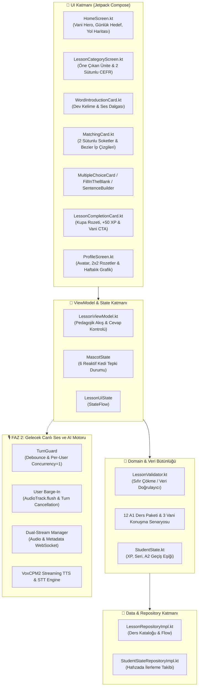

# MyAICoach: Sistem Mimarisi, Tamamlanan Geliştirmeler ve Topoloji Raporu

> **Proje Vizyonu**: "Vani öğretilecek bilgiyi icat etmeyecek; öğretim biçimini kişiselleştirecek."  
> CEFR ve Oxford 3000/5000 standartlarında, oyunlaştırılmış ve gerçek zamanlı AI konuşma koçluğu sunan modern Android uygulaması.

---

## 📐 1. Genel Sistem Topolojisi (System Topology)



---

## 🏆 2. Şu Ana Kadar Neler Yaptık? (Tamamlanan Aşamalar)

### 🎨 A. 7 Ekranlık Bütünsel UI Tasarım Sistemi (100% Tamamlandı)
1. **HomeScreen.kt**: Mor-turkuaz aura animasyonlu **Vani AI Kedi Hero Kartı**, dairesel %80 günlük hedef çemberi, 🔥 7 Günlük Seri ve dikey yol haritası.
2. **LessonCategoryScreen.kt**: Öne Çıkan Ünite Banner'ı (%33 İlerleme) ve 2 sütunlu asimetrik CEFR kategori kartları (Gramer, Günlük Yaşam, Seyahat, İş).
3. **WordIntroductionCard.kt**: Dev kelime başlığı, dairesel ses dalgası animasyonlu oynatma butonu (`scale(0.94f)`).
4. **MatchingCard.kt**: Soketli 2 sütunlu düğümler, **Canvas Bezier ip çizgileri**, dokun-iptal et ve çakışmayan dinamik boş renk seçim algoritması.
5. **SentenceBuilderCard.kt & Quiz Kartları**: Yay fiziğiyle mikro basılma animasyonları (`scale(0.95f)`), dinamik renkli tepsi ve şıklar.
6. **LessonCompletionCard.kt**: Altın kupa rozeti, `+50 XP` animasyonlu sayacı, konfeti patlaması ve doğrudan **"🎙️ Vani ile Konuşmaya Başla"** CTA butonu.
7. **ProfileScreen.kt**: Kullanıcı avatarı, CEFR A1 seviye rozeti, 3 sütunlu istatistikler, 2x2 ışıldayan başarım rozetleri ve haftalık aktiflik grafiği.

---

### 🐱 B. Vani AI Kedi Maskotu Tepki Durumları (`MascotState`)
- **`IDLE`**: Hazır bekleme (kulaklığıyla gülüser).
- **`LISTENING`**: Dinleme (patisini kulağına götürür, ses dalgaları parlar).
- **`THINKING`**: Düşünme (patisini çenesine götürür, parıltı efekti).
- **`SPEAKING`**: Konuşma (VoxCPM2 ses yayını sırasında ağzı hareket eder).
- **`HAPPY_CHEERING`**: Tebrik (patilerini sevinçle kaldırır).
- **`GENTLE_HINT`**: Nazik Düzeltme (başını sallar ve ipucu verir).

---

### 📚 C. Tam CEFR A1 Müfredat Deposu (12 Core Ders + 3 Konuşma Senaryosu)
- **Ünite 1 (Greetings & Daily Life)**: `A1Lesson1` - `A1Lesson4` + `A1Scenario1` (Kafede Vani ile Tanışma).
- **Ünite 2 (Food, Drinks & Shopping)**: `A1Lesson5` - `A1Lesson8` + `A1Scenario2` (Süpermarket & Kafe Turu).
- **Ünite 3 (City, Places & Travel)**: `A1Lesson9` - `A1Lesson12` + `A1Scenario3` (🎓 A1 → A2 Mezuniyet Konuşması).

---

### 🛡️ D. Veri Bütünlüğü ve Repository Katmanı
- **`LessonValidator.kt`**: Ders yüklenirken verileri otomatik tarayan koruma katmanı.
- **`LessonRepositoryImpl.kt`**: Tüm 12 dersi dinamik `Flow` ile sunan katalog.
- **`StudentStateRepositoryImpl.kt`**: Öğrencinin tamamladığı dersleri, kazandığı XP puanlarını (+50 XP) ve A2 geçiş barajını (400+ kelime) takip eden altyapı.

---

## 🚀 3. Ne Yapacağız? (Gelecek Adımlar - FAZ 2)

```
[ Aşamalı FAZ 2 Yol Haritası ]
  ├── 1. Tur Durum Makinesi (Turn State Machine & Mascot Integration)
  ├── 2. TurnGuard (Debounce limitleri & abuse önleme)
  ├── 3. User Barge-In (Kullanıcı araya girdiğinde AudioTrack.flush & Turn Cancel)
  └── 4. VoxCPM2 Streaming TTS & Düşük Gecikmeli Audio Playback
```

1. **Vani Canlı Konuşma Tur Motoru (Turn State Machine)**:
   - `CREATED` → `LISTENING` → `TRANSCRIBED` → `LLM_GENERATING` → `TTS_GENERATING` → `PLAYING` → `COMPLETED` adımlarının Android UI ve ViewModel'e bağlanması.
2. **User Barge-In (Araya Girme)**:
   - Kullanıcı Vani konuşurken mikrofona bastığı an aktif `turnId` iptal edilecek, Android `AudioTrack.flush()` çalıştırılıp ses anında kesilecek.
3. **TurnGuard Güvenliği**:
   - Mikrofona üst üste hızlı basılması engellenecek (min 300ms debounce), kullanıcı başına aynı anda tek aktif tur izni verilecek.
4. **VoxCPM2 Streaming TTS & Ses Çalma Engine**:
   - Cümle/clause tabanlı ses akar akmaz sıfır gecikmeye yakın çalma motoru entegre edilecek.
